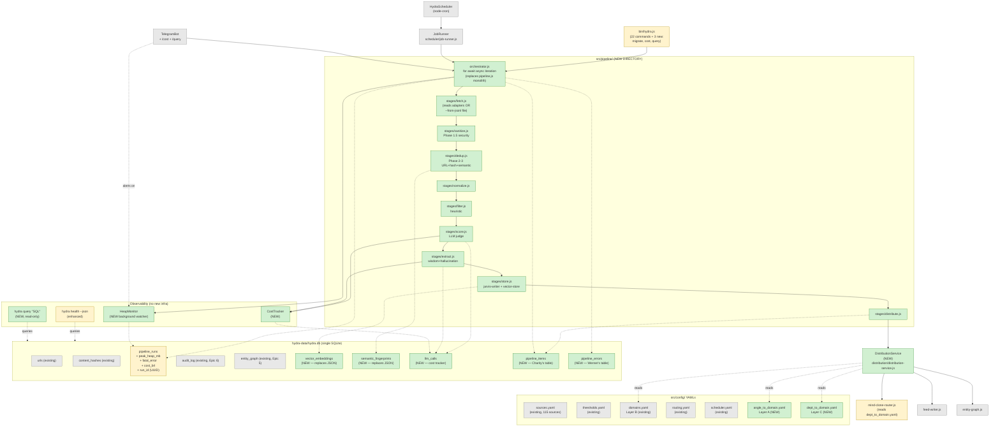
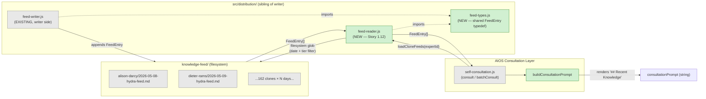

# HYDRA Resilience Sprint — Brownfield Enhancement Architecture

**Project:** HYDRA Content Intelligence System (v1.0.0 → v1.1.0)
**Sprint codename:** Resilience
**Document type:** Brownfield Enhancement Architecture
**Author:** Aria (@architect) — synthesizing PRD v0.5 + conclave 3/3
**Date:** 2026-05-11
**Source of truth for current state:** `01-analysis/project-documentation.md` (828 lines)
**Source of truth for requirements:** `02-prd/prd.md` (PRD v0.5, 11 stories)
**Source of truth for decisions:** `03-architecture/conclave/conclave-output.md` (martin-fowler + werner-vogels + charity-majors)

---

## 1. Introduction & Scope

### 1.1 Sprint Goal (in my voice)

Restore HYDRA's autonomous 24/7 operation by eliminating the OOM root cause at its source (JSON write-amplification in `vector-store` + `semantic-dedup`), splitting the 963-LOC pipeline monolith into discrete streamable stages, and collapsing the two divergent distribution codepaths (live pipeline vs. `ingest-dossier.mjs`) into a single `DistributionService`. As a side-benefit — and on Charity Majors' insistence — we make the system **queryable**: every item that flows through the pipeline becomes a row in SQLite, addressable via a new `hydra query` CLI, so six months from now we can answer questions we haven't thought to ask yet.

### 1.2 What this document is NOT

- Not a greenfield architecture. We respect existing patterns (ESM + `createRequire` for `better-sqlite3`, JSDoc typedefs, YAML config, pino structured logs, file-based locks).
- Not an opportunity to introduce TypeScript, ORMs, Prometheus, or microservices. The conclave was unanimous: this is a **single-machine CLI tool** and over-engineering would dilute the focus.
- Not implementation. No code is written here. The work is captured in PRD stories 1.1–1.11 and will be sharded by @sm into developer-actionable units.

### 1.3 Scope Boundaries

**IN scope:**
- 2 storage migrations (vector-store + semantic-dedup → SQLite)
- 1 pipeline refactor (monolith → orchestrator + 9 stages, streaming execution)
- 1 distribution consolidation (`DistributionService` + 3-layer YAML config)
- 1 new CLI flag (`--from-jsonl`) + 2 new CLI commands (`hydra cost`, `hydra query`)
- 3 observability table additions (`pipeline_items`, `pipeline_errors`, `llm_calls`)
- 1 column expansion on existing `pipeline_runs` table

**OUT of scope (explicit non-goals):**
- Node 22/24 upgrade (CR6)
- TypeScript migration
- New top-level dependencies (sprint-wide constraint per PRD §3.1)
- HTTP API surface (HYDRA remains CLI-first)
- Replacing Telegram with anything else
- Migrating off Jest

### 1.4 Document Map

| Section | Purpose |
|---------|---------|
| §2 High-Level Architecture (Target State) | What HYDRA looks like at sprint-end, contrasted with `01-analysis` §2 |
| §3 Migration Strategy | Phased plan referencing PRD story numbers |
| §4 Module Specifications | Each new/changed module: interface, deps, file path, test strategy |
| §5 Data Model Changes | DDL for new tables + columns (all additive per CR2) |
| §6 Configuration Changes | New YAMLs + env vars |
| §7 Risk Mitigation Matrix | Maps each PRD §3.5 risk to an architectural decision |
| §8 Test Strategy | Characterization, benchmark, per-stage failure, observability |
| §9 Rollback Plan | Env flags + JSON restore + git checkpoint |
| §10 ADR Index | Links to 3 formal ADRs in `adrs/` |
| §11 Open Questions for Orion | What I want to clarify before @po validates |

---

## 2. High Level Architecture (Target State)

### 2.1 Component Diagram — Post-Sprint



**Legend:** green = new, yellow = changed, gray = preserved unchanged.

### 2.2 Contrast with Current State (`01-analysis` §2.1)

| Concern | Current (DOWN since 16/Abr) | Post-Sprint |
|---------|------------------------------|-------------|
| Entry points | `bin/hydra.js` (22 cmds) + `bin/ingest-dossier.mjs` (divergent) | `bin/hydra.js` (25 cmds, including `--from-jsonl`); `ingest-dossier.mjs` survives as a 1-line wrapper with deprecation warning |
| Pipeline execution | 963-LOC monolith, all items in `allContent[]` array | Orchestrator + 9 stage modules, async iteration, one item at a time |
| `vector-store` persistence | 16.7MB JSON file rewritten per item | SQLite `vector_embeddings` table + in-memory LRU cosine cache (ADR-002) |
| `semantic-dedup` persistence | 20.7MB JSON file rewritten per item | SQLite `semantic_fingerprints` table + LRU cache |
| Distribution routing | 2 codepaths, 2 hardcoded `deptToDomainMap`s in JS | 1 `DistributionService` + 3 YAMLs (angle / domain / dept) |
| Heap peak | OOM at ≥1.7GB (default) and ≥8GB (`--max-old-space-size=8192`) | < 2GB for 5,000-item run (NFR1) |
| Observability | `pino` to disk + Telegram alerts + opaque `pipeline_runs` row | All above + `pipeline_items` row per item + `hydra query` CLI |
| Cost tracking | None | `llm_calls` table + `hydra cost` + Telegram digest in BRL |
| Run failure handling | One bad item kills the whole run (thrown exception bubbles up) | Per-stage `{success, error}` shape; failures land in `pipeline_errors`; run continues |
| MTTR on scheduler crash | ~25 days (actual, per heartbeat) | < 5 min (NFR4) via Telegram alert + documented runbook |

### 2.3 Architectural Style

**Unchanged:** Single-process Node.js CLI tool, SQLite for state, filesystem for artifact output (Jarvis KB markdown, daily digests).

**Refined:** The pipeline transitions from **batch-collecting orchestration** to **stream-processing orchestration**. This is not a new architectural style — it's the obvious style for the problem, and we should have been doing it from day one. Conclave was unanimous: pure async iteration (`for await of`), no Worker threads, no queue-based backpressure, no message bus. Backpressure is `await`.

---

## 3. Migration Strategy

### 3.1 Phased Approach

Six phases, ordered by dependency and risk. Each phase maps to one or more PRD stories. Stories within a phase can run in parallel where the dependency graph allows (see PRD §5.1).

#### Phase 0 — Preflight Infrastructure
**Story:** 1.1 (partial — preflight + status.js + characterization fixture)
**Goal:** Make migration safe to attempt and refactor safe to verify.

**Outputs:**
- `scripts/preflight/` directory (7 scripts, each < 50 LOC)
- `src/status.js:9` migrated off legacy `getIndexStats()`
- `tests/fixtures/pipeline-characterization-2026-05-11/` — 50-item snapshot of current pipeline output
- `tests/pipeline.characterization.test.js` — Fowler's regression net

**Exit gate:** All 7 preflight scripts exit 0 on a clean working tree; characterization test green against unchanged code.

#### Phase 1 — Migrate Storage (vector-store + semantic-dedup)
**Stories:** 1.2 + 1.3 (parallel-safe)
**Goal:** Eliminate the JSON write-amplification at its source. SQLite becomes the single substrate.

**Critical sequencing:**
1. Story 1.2 ships its 1-day benchmark spike FIRST (ADR-002 exit criterion). LRU vs sqlite-vss on a 10k-vector fixture; LRU is the default winner unless data dictates otherwise.
2. Migrations are gated by `preflight/all.mjs` — refuse to run if backups absent (R11 mitigation).
3. JSON files renamed to `*.legacy.json` (not deleted) for **one release cycle** (NFR8). Env flag `HYDRA_USE_LEGACY_VECTOR_STORE=1` reactivates the legacy reader.
4. Post-flight script confirms SQLite row count == JSON entry count.

**Exit gate:** `hydra search "..."` returns top-K identical to pre-migration on a 100-query fixture (IV1 of Story 1.2). Heap delta measurable on a 1000-item synthetic run.

#### Phase 2 — Split the Pipeline Monolith
**Story:** 1.4
**Goal:** Break `pipeline.js` (963 LOC) into `orchestrator.js` + 9 stage modules. **No streaming yet.** Behavior identical.

**Why this is its own phase (Fowler's insistence):** "The Extract Method refactor + the streaming refactor are TWO different changes — sequence them, don't compound the risk." Split first, verify against characterization fixture, then change semantics in Phase 3.

**Compatibility:** Original `src/pipeline.js` retained as a thin re-export shim:
```js
export { runPipeline } from './pipeline/orchestrator.js';
```
Internal imports keep working; the file is removed in the **next** sprint.

**Exit gate:** Characterization test from Phase 0 produces zero diff. All 22 CLI commands behave identically (IV1 of Story 1.4).

#### Phase 3 — Streaming Pipeline Execution
**Story:** 1.5
**Goal:** Change semantics — items flow one at a time. Backpressure via `await`. Per-stage `{success, error}` contract.

**Critical changes:**
- `orchestrator.js` becomes `for await (const item of fetchStream())`.
- `allContent[]` array eliminated; each item is fully processed (or discarded) before the next fetch.
- Every stage function returns `{ success: true, item } | { success: false, error, item }`. No throws across boundaries.
- Failed items written to `pipeline_errors` (table created in Phase 5).
- Error rate >10% triggers Telegram HIGH severity alert (does NOT abort the run).

**Exit gate:** Heap budget test (NFR1) passes — 5,000-item synthetic run peaks under 2GB. Characterization test still green.

#### Phase 4 — Unify Distribution Codepaths
**Stories:** 1.6 + 1.7 (1.7 depends on 1.6)
**Goal:** One `DistributionService`. Three YAMLs. `--from-jsonl` flag becomes the canonical dossier-ingest path.

**Critical changes:**
- `src/distribution/distribution-service.js` becomes the only caller of `routeToMindClones()` + `writeKnowledgeFeed()`.
- `mind-clone-router.js` map (lines 159-191) extracted to `src/config/dept_to_domain.yaml`.
- `bin/ingest-dossier.mjs` angle map (lines 50-64) extracted to `src/config/angle_to_domain.yaml`.
- `bin/ingest-dossier.mjs` reduced to a deprecation wrapper:
  ```js
  console.warn('[deprecated] use `hydra run --from-jsonl <path>` instead');
  process.argv.splice(2, 0, 'run', '--from-jsonl', '--skip-phases', 'fetch,sanitize,score,extract,hallucination');
  require('./hydra.js');
  ```
- Snapshot test (Story 1.6 AC #7): routing decisions for 100 sample items diff = empty before/after.

**Exit gate:** Anipis (08/Mai) + High-Ticket (08/Mai) reference JSONLs replayed through `hydra run --from-jsonl` produce byte-identical feed writes (IV1 of Story 1.7).

#### Phase 5 — Observability + Cost Tracking
**Stories:** 1.8 + 1.9 + 1.11
**Goal:** SQLite-based observability stack. Heap monitor. Cost tracker. `pipeline_items` table. `hydra query` CLI.

**Story 1.8 (cost tracker):** Parallel-safe with everything else in Phase 5. Adds `llm_calls` table + `hydra cost` + Telegram `/cost`. Hooks into `stages/score.js` and `stages/extract.js`.

**Story 1.9 (graceful shutdown + heap monitor):** Background watcher samples `process.memoryUsage().heapUsed` every 5s, logs `pipeline_runs.peak_heap_mb`, fires Telegram alert at `HYDRA_HEAP_WARN_MB` threshold (default 1800). SIGTERM handler sequences `auditLogger.close() → entityGraph.close() → dedupStore.close()`.

**Story 1.11 (Charity's per-item observability):** Adds `pipeline_items` table (one row per item processed, success OR failure) + `pipeline_errors` table + `hydra query "<sql>"` read-only CLI + 5 starter queries in `05-runbook/queries.md`. **This story is what makes the rest of the sprint worth doing in six months** — the substrate for questions we haven't thought to ask yet.

**Exit gate:** Story 1.11 IVs pass — 100-item test run inserts exactly 100 rows; `hydra query "DROP TABLE pipeline_runs"` correctly refused.

#### Phase 6 — Runbooks + Documentation
**Story:** 1.10
**Goal:** Documented operability. Migration runbook, scheduler recovery runbook, updated `.env.example`, updated project memory.

**Exit gate:** Runbook is step-by-step executable by Orion/agent without code knowledge. Rollback procedure tested end-to-end on a copy of `hydra-data/`.

### 3.2 Story Sequence Visualization

```
Phase 0  ├─ Story 1.1 (preflight + status.js + characterization)
         │
Phase 1  ├─ Story 1.2 (vector-store SQLite + LRU benchmark spike) ─┐
         ├─ Story 1.3 (semantic-dedup SQLite)                       │ parallel
         │                                                          │
Phase 2  ├─ Story 1.4 (pipeline split — orchestrator + stages) ◄────┘ (1.4 needs 1.2+1.3 stable)
         │
Phase 3  ├─ Story 1.5 (streaming + per-stage {success, error})
         │
Phase 4  ├─ Story 1.6 (DistributionService + 3 YAMLs) ─┐
         ├─ Story 1.7 (--from-jsonl flag)              │ 1.7 needs 1.6
         │
Phase 5  ├─ Story 1.8 (cost tracker) ─┐
         ├─ Story 1.9 (graceful shutdown + heap monitor)
         ├─ Story 1.11 (pipeline_items + hydra query)
         │  (all 3 parallel-safe after 1.5)
         │
Phase 6  └─ Story 1.10 (runbook + docs)
```

**Critical path:** 1.1 → 1.4 → 1.5 → 1.11 → 1.10 (sequential, ~8 stories on the longest chain).

### 3.3 Recommended Parallel Start

**Story 1.1 is the unblocker for everything.** It produces the preflight scripts AND the characterization fixture. Without the fixture, Stories 1.4 and 1.5 cannot merge (the characterization test is their merge gate).

My recommendation to Orion (open question §11 below): **Story 1.1's preflight scripts can begin running in production NOW, in parallel with the rest of the Story development cycle.** They are read-only verification, < 50 LOC each, with no external dependencies. Running them daily during sprint development gives early warning if (e.g.) disk fills up or someone fat-fingers `.env`. The characterization fixture work, by contrast, must be completed and merged before Story 1.4 begins.

---

## 4. Module / Stage Specifications

For each new or rewritten module, the spec covers:
- **File location** (absolute path)
- **Public interface** (function signatures with JSDoc)
- **Dependencies on existing modules**
- **Test strategy**

### 4.1 `src/pipeline/orchestrator.js` (NEW — replaces `pipeline.js` monolith)

**File:** `D:/AIOS/tools/hydra/src/pipeline/orchestrator.js`
**Replaces:** `D:/AIOS/tools/hydra/src/pipeline.js` (963 LOC monolith) — original file retained as 1-line re-export shim

**Public interface:**
```js
/**
 * Run the HYDRA content pipeline using streaming async iteration.
 *
 * @param {object} options
 * @param {string[]} [options.sources]      - Filter by source type (rss/github/...)
 * @param {string}   [options.fromJsonl]    - Read items from JSONL file instead of source adapters (FR3)
 * @param {string[]} [options.skipPhases]   - Phase names to skip (e.g., ['fetch', 'sanitize'])
 * @param {boolean}  [options.dryRun]       - Skip writes (no feed/jarvis output)
 * @param {boolean}  [options.noDistribute] - Skip Phase 7 distribution
 * @param {string}   [options.configDir]    - Override config dir (for tests)
 * @returns {Promise<PipelineRunSummary>}
 */
export async function runPipeline(options) { ... }

/**
 * @typedef {object} PipelineRunSummary
 * @property {string} runId                 - UUID for this run (Werner's ADR-003)
 * @property {number} totalFetched
 * @property {number} totalProcessed
 * @property {number} totalDistributed
 * @property {number} totalFailed
 * @property {number} errorRate
 * @property {number} peakHeapMb
 * @property {number} costBrl
 * @property {object} stageStats            - Per-stage success/failure counts
 * @property {number} durationMs
 */
```

**Dependencies on existing modules:**
- `src/dedup/dedup-store.js` (SQLite singleton) — UNCHANGED
- `src/security/audit-logger.js` — UNCHANGED, but Story 1.9 makes `orchestrator.js` call `close()` on SIGTERM
- `src/distribution/entity-graph.js` — UNCHANGED
- All 9 stage modules in `src/pipeline/stages/` (NEW, see §4.2-§4.10)
- `src/monitoring/cost-tracker.js` (NEW, see §4.12)
- `src/monitoring/heap-monitor.js` (NEW, see §4.13)

**Test strategy:**
- `tests/pipeline.integration.test.js` (FR6) — E2E with 1 fixture RSS source + mock LLM
- `tests/pipeline.characterization.test.js` — Fowler's snapshot test against 50-item fixture (Story 1.1)
- `tests/pipeline/heap-budget.test.js` — NFR1 (5,000-item synthetic run, assert heap < 2GB)
- `tests/pipeline/per-stage-failure.test.js` — inject failures at each stage, assert `pipeline_errors` rows + Telegram alert above 10%

### 4.2-4.10 Stage Modules (`src/pipeline/stages/`)

Each stage is a **pure async function** with the contract:

```js
/**
 * @callback StageFn
 * @param {Item}    item     - Input item
 * @param {Context} context  - Run-scoped context (run_id, configs, db handle, logger)
 * @returns {Promise<{success: true, item: Item} | {success: false, error: Error, item: Item, stage: string}>}
 */
```

**Critical:** No throws across stage boundaries (Werner's ADR-001 augmentation). All errors caught at the stage function level and returned as `{success: false}`. Orchestrator handles `{success: false}` by writing to `pipeline_errors` and continuing.

| Stage file | Phase | Replaces (in `pipeline.js`) | Test file |
|---|---|---|---|
| `stages/fetch.js` | 1 | lines 233-275 (`fetchAllSources`) | `tests/pipeline/stages/fetch.test.js` |
| `stages/sanitize.js` | 1.5 | calls into `security/input-sanitizer.js` | `tests/pipeline/stages/sanitize.test.js` |
| `stages/dedup.js` | 2-3 | URL + content-hash + semantic-dedup combined | `tests/pipeline/stages/dedup.test.js` |
| `stages/normalize.js` | 3 | calls `processor/normalizer.js` | `tests/pipeline/stages/normalize.test.js` |
| `stages/filter.js` | 4 | calls `curator/heuristic-filter.js` | `tests/pipeline/stages/filter.test.js` |
| `stages/score.js` | 5 | scoring-cache + llm-judge — calls cost-tracker | `tests/pipeline/stages/score.test.js` |
| `stages/extract.js` | 5b/5c | extractor + hallucination — calls cost-tracker | `tests/pipeline/stages/extract.test.js` |
| `stages/store.js` | 6 | jarvis-writer + vector-store | `tests/pipeline/stages/store.test.js` |
| `stages/distribute.js` | 7 | calls `DistributionService` (NEW, §4.11) | `tests/pipeline/stages/distribute.test.js` |

**Special note on `stages/fetch.js`:** This stage has two modes:
- **Source-adapter mode** (default): iterates over sources from `sources.yaml`, calls per-type adapter, yields items via async generator
- **JSONL mode** (when `--from-jsonl <path>` is set): reads the file line-by-line, parses each line, yields items via async generator

Both modes implement the same async-iterator interface, so the rest of the orchestrator is mode-agnostic.

### 4.11 `src/distribution/distribution-service.js` (NEW)

**File:** `D:/AIOS/tools/hydra/src/distribution/distribution-service.js`
**Purpose:** Single caller path for `routeToMindClones()` + `writeKnowledgeFeed()` + `entityGraph.registerEntities()`. Eliminates the divergence documented in `01-analysis` §5.2 (pipeline.js:732-775 vs ingest-dossier.mjs:50-74).

**Public interface:**
```js
/**
 * @typedef {object} DistributionResult
 * @property {string[]} clonesRouted       - Clone IDs that received the item
 * @property {number}   feedsWritten        - Files actually written to disk
 * @property {boolean}  entitiesRegistered  - Whether entity-graph was updated
 */

/**
 * Distribute a single item to mind-clone feeds.
 *
 * @param {NormalizedItem} item
 * @param {object} options
 * @param {string} [options.runId]         - UUID for observability
 * @param {string} [options.knowledgeFeedDir] - Override default Jarvis path (for tests)
 * @returns {Promise<DistributionResult>}
 */
export async function distributeItem(item, options = {}) { ... }

/**
 * Load + cache all 3 routing YAMLs (Layer A/B/C) at startup.
 * Called once by orchestrator before pipeline begins.
 *
 * @param {string} [configDir]
 * @returns {Promise<RoutingMaps>}
 */
export async function loadRoutingMaps(configDir) { ... }
```

**Dependencies on existing modules:**
- `src/distribution/mind-clone-router.js` — REUSED (routing algorithm preserved; only data source moves to YAML)
- `src/distribution/feed-writer.js` — UNCHANGED (CR3: feed format byte-compatible)
- `src/distribution/entity-graph.js` — UNCHANGED

**Test strategy:**
- `tests/distribution/distribution-service.test.js` — unit tests for `distributeItem` with mock router/writer
- `tests/distribution/routing-snapshot.test.js` — Story 1.6 AC #7: routing decisions for 100 sample items diff = empty before/after
- `scripts/validate-domain-mapping.mjs` — validation script that ensures no orphan keys across the 3 YAMLs (every department maps to a valid domain; every clone referenced exists in `mind-clone-index.json`)

### 4.12 `src/monitoring/cost-tracker.js` (NEW)

**File:** `D:/AIOS/tools/hydra/src/monitoring/cost-tracker.js`
**Purpose:** Per-LLM-call token + cost logging (FR8, Story 1.8).

**Public interface:**
```js
/**
 * Log a single LLM call. Async fire-and-forget; failure logs warning, never throws.
 *
 * @param {object} call
 * @param {string} call.runId
 * @param {string} call.provider           - 'deepseek' | 'anthropic' | 'openai'
 * @param {string} call.model              - e.g. 'deepseek-chat'
 * @param {number} call.tokensIn
 * @param {number} call.tokensOut
 * @returns {Promise<void>}
 */
export async function track(call) { ... }

/**
 * Aggregate cost summary.
 *
 * @param {object} filter
 * @param {number} [filter.days]
 * @param {string} [filter.runId]
 * @param {string} [filter.provider]
 * @returns {Promise<{costBrl: number, costUsd: number, byProvider: object, callCount: number}>}
 */
export async function summarize(filter) { ... }
```

**Pricing config (hardcoded constants for sprint; could move to YAML later):**
```js
const PRICING_USD_PER_1M_TOKENS = {
  'deepseek-chat':       { input: 0.27, output: 1.10 },
  'claude-3-5-sonnet':   { input: 3.00, output: 15.00 },
  'gpt-4o':              { input: 2.50, output: 10.00 },
  // ...
};
```

**Dependencies:**
- `src/dedup/dedup-store.js` — reuses SQLite singleton (writes to new `llm_calls` table)
- `src/logging/logger.js` — pino logger for warnings

**Test strategy:**
- `tests/monitoring/cost-tracker.test.js` — track + summarize unit tests
- Overhead test: assert `track()` adds < 5ms per LLM call (R5 mitigation)

### 4.13 `src/monitoring/heap-monitor.js` (NEW)

**File:** `D:/AIOS/tools/hydra/src/monitoring/heap-monitor.js`
**Purpose:** Background watcher samples `process.memoryUsage().heapUsed` every 5s, fires Telegram alert at threshold (Story 1.9).

**Public interface:**
```js
/**
 * Start background heap sampling. Returns a controller for stop + getPeak.
 *
 * @param {object} options
 * @param {number} [options.intervalMs=5000]
 * @param {number} [options.warnThresholdMb=1800]   - HYDRA_HEAP_WARN_MB
 * @param {function} [options.onWarn]                - Callback when threshold crossed
 * @returns {{stop: () => number}}                   - stop() returns peak heap in MB
 */
export function startHeapMonitor(options = {}) { ... }
```

**Dependencies:**
- `src/monitoring/telegram-alerter.js` — UNCHANGED, called via `onWarn` callback
- `src/logging/logger.js`

**Test strategy:**
- `tests/monitoring/heap-monitor.test.js` — mock `process.memoryUsage`, assert threshold crossing triggers callback exactly once per run

### 4.14 `bin/hydra.js` changes (NEW SUB-COMMANDS)

**File:** `D:/AIOS/tools/hydra/bin/hydra.js`
**Changes:**
- New flag on `hydra run`: `--from-jsonl <path>` + `--skip-phases <phase1,phase2>`
- New sub-command: `hydra migrate vector-store`
- New sub-command: `hydra migrate semantic-dedup`
- New sub-command: `hydra cost [--days N] [--run-id X] [--provider P]`
- New sub-command: `hydra query "<sql>"` (read-only, parameterized — see §4.15)

All preserved per CR1 (existing 22 commands behave identically; new commands are additive).

### 4.15 `hydra query` Command — Safety Design

**File:** `D:/AIOS/tools/hydra/bin/hydra.js` (handler) + `D:/AIOS/tools/hydra/src/query/query-runner.js` (NEW)

**Why this is its own subsection:** Charity Majors' ADR-003 calls for ad-hoc SQL access. Done naively, this is a SQL injection vector even for the operator. Done well, it's the most valuable observability tool in the sprint.

**Safety design (Story 1.11 AC #5):**

1. **Read-only enforcement:** Parse the user's SQL with a lightweight regex check; reject any of `INSERT|UPDATE|DELETE|DROP|ALTER|CREATE|REPLACE|PRAGMA|ATTACH|DETACH` (case-insensitive). Additionally, open the SQLite connection in read-only mode for this command via `new Database(path, { readonly: true })`.
2. **Parameterized:** Accept named params on the CLI: `hydra query "SELECT * FROM pipeline_runs WHERE run_id = :rid" --param rid=abc123`. Refuse string concatenation patterns in the input SQL.
3. **Output:** JSON array printed to stdout. `--csv` flag for CSV (post-sprint enhancement, not in scope).
4. **Saved queries:** Story 1.11 AC #7 — 5 starter queries documented in `05-runbook/queries.md`. Telegram bot `/query <saved-name>` resolves the name to one of these.

**Test strategy:**
- `tests/query/query-runner.test.js` — assert read-only enforcement (Story 1.11 IV3)
- `tests/query/saved-queries.test.js` — each of the 5 starters returns a valid result against fixture DB

---

## 5. Data Model Changes (All Additive per CR2)

### 5.1 New Tables

#### `vector_embeddings` (Story 1.2)

```sql
CREATE TABLE IF NOT EXISTS vector_embeddings (
  id              INTEGER PRIMARY KEY AUTOINCREMENT,
  content_id      TEXT    NOT NULL UNIQUE,    -- sha256 of url, links to content_hashes.content_id
  embedding_blob  BLOB    NOT NULL,           -- Float32Array serialized as BLOB
  dimension       INTEGER NOT NULL,            -- typically 1536 (OpenAI ada-002 era) or 768 (smaller models)
  source_name     TEXT,                       -- optional, for query filtering
  created_at      INTEGER NOT NULL DEFAULT (unixepoch())
);

CREATE INDEX IF NOT EXISTS idx_vector_embeddings_content_id
  ON vector_embeddings(content_id);
```

**Note on BLOB encoding:** Embeddings stored as little-endian Float32Array serialized via `Buffer.from(new Float32Array(vec).buffer)`. Deserialized on read. Avoids JSON parsing overhead per row.

**Migration source:** `hydra-data/vectors/vector-index.json` (16.7MB). One-shot script `hydra migrate vector-store` reads JSON, iterates entries, bulk-inserts via transaction.

#### `semantic_fingerprints` (Story 1.3)

```sql
CREATE TABLE IF NOT EXISTS semantic_fingerprints (
  id                INTEGER PRIMARY KEY AUTOINCREMENT,
  content_id        TEXT    NOT NULL UNIQUE,
  fingerprint_hash  TEXT    NOT NULL,        -- e.g., MinHash signature
  title_normalized  TEXT    NOT NULL,
  source_name       TEXT,
  created_at        INTEGER NOT NULL DEFAULT (unixepoch())
);

CREATE INDEX IF NOT EXISTS idx_semantic_fp_hash      ON semantic_fingerprints(fingerprint_hash);
CREATE INDEX IF NOT EXISTS idx_semantic_fp_title     ON semantic_fingerprints(title_normalized);
CREATE INDEX IF NOT EXISTS idx_semantic_fp_content   ON semantic_fingerprints(content_id);
```

**Migration source:** `hydra-data/fingerprints/fingerprints.json` (20.7MB).

#### `llm_calls` (Story 1.8)

```sql
CREATE TABLE IF NOT EXISTS llm_calls (
  id            INTEGER PRIMARY KEY AUTOINCREMENT,
  run_id        TEXT    NOT NULL,             -- FK to pipeline_runs.run_id
  provider      TEXT    NOT NULL,             -- 'deepseek' | 'anthropic' | 'openai'
  model         TEXT    NOT NULL,
  tokens_in     INTEGER NOT NULL,
  tokens_out    INTEGER NOT NULL,
  cost_usd      REAL    NOT NULL,
  cost_brl      REAL    NOT NULL,             -- computed at write time using HYDRA_COST_BRL_RATE
  stage         TEXT,                         -- 'score' | 'extract' | etc.
  created_at    INTEGER NOT NULL DEFAULT (unixepoch())
);

CREATE INDEX IF NOT EXISTS idx_llm_calls_run_id    ON llm_calls(run_id);
CREATE INDEX IF NOT EXISTS idx_llm_calls_created   ON llm_calls(created_at);
```

#### `pipeline_items` (Story 1.11 — Charity's table)

```sql
CREATE TABLE IF NOT EXISTS pipeline_items (
  id                    TEXT    PRIMARY KEY,              -- UUID
  run_id                TEXT    NOT NULL,                 -- FK to pipeline_runs.run_id
  item_id               TEXT    NOT NULL,                 -- sha256 of url
  source_name           TEXT,
  final_stage           TEXT    NOT NULL,                 -- 'distributed' | 'deduped' | 'filtered' | 'failed' | 'stored_only'
  tier                  TEXT,                             -- 'S' | 'A' | 'B' | NULL
  cost_cents            INTEGER DEFAULT 0,                -- sum of LLM cost cents for this item
  duration_ms           INTEGER NOT NULL,
  clones_routed_count   INTEGER DEFAULT 0,
  created_at            INTEGER NOT NULL DEFAULT (unixepoch())
);

CREATE INDEX IF NOT EXISTS idx_pipeline_items_run        ON pipeline_items(run_id);
CREATE INDEX IF NOT EXISTS idx_pipeline_items_source     ON pipeline_items(source_name);
CREATE INDEX IF NOT EXISTS idx_pipeline_items_stage      ON pipeline_items(final_stage);
CREATE INDEX IF NOT EXISTS idx_pipeline_items_tier       ON pipeline_items(tier);
CREATE INDEX IF NOT EXISTS idx_pipeline_items_created    ON pipeline_items(created_at);
```

#### `pipeline_errors` (Story 1.11 — Werner's table)

```sql
CREATE TABLE IF NOT EXISTS pipeline_errors (
  id              INTEGER PRIMARY KEY AUTOINCREMENT,
  run_id          TEXT    NOT NULL,
  item_id         TEXT,                                   -- nullable: some errors are stage-wide, not per-item
  stage           TEXT    NOT NULL,
  error_message   TEXT    NOT NULL,
  stack_trace     TEXT,
  created_at      INTEGER NOT NULL DEFAULT (unixepoch())
);

CREATE INDEX IF NOT EXISTS idx_pipeline_errors_run    ON pipeline_errors(run_id);
CREATE INDEX IF NOT EXISTS idx_pipeline_errors_stage  ON pipeline_errors(stage);
```

### 5.2 Modified Tables (All Additive — New Columns with Defaults)

#### `pipeline_runs` (existing — additions for ADR-003 observability)

```sql
ALTER TABLE pipeline_runs ADD COLUMN run_id        TEXT;          -- UUID, populated for new runs (legacy NULL)
ALTER TABLE pipeline_runs ADD COLUMN peak_heap_mb  INTEGER;
ALTER TABLE pipeline_runs ADD COLUMN fatal_error   TEXT;
ALTER TABLE pipeline_runs ADD COLUMN cost_brl      REAL;
```

**Backward compatibility:** All new columns are nullable / have implicit NULL default. Existing `SELECT total_fetched, total_processed FROM pipeline_runs` queries unaffected. Legacy rows have NULL run_id; new queries that filter by run_id naturally exclude them.

### 5.3 Retention Rules (Story 1.11 AC #8)

Daily cleanup job scheduled via existing `HydraScheduler` at **03:00 BRT** (low-traffic window). Implemented as a new `scheduler` job that calls a function in `src/dedup/dedup-store.js` (extending existing maintenance helpers).

| Table | Retention | Cleanup query |
|---|---|---|
| `pipeline_runs` | 90 days | `DELETE FROM pipeline_runs WHERE created_at < unixepoch('now', '-90 days')` |
| `pipeline_items` | 30 days | (same pattern) |
| `pipeline_errors` | 30 days | (same pattern) |
| `llm_calls` | 90 days | (same pattern) |
| `audit_log` | 90 days (EXISTING, unchanged) | (no change) |
| `vector_embeddings` | indefinite (corpus) | no cleanup — content lifecycle is independent |
| `semantic_fingerprints` | indefinite (corpus) | no cleanup |

**Critical:** Cleanup uses `BEGIN IMMEDIATE` (acquires write lock immediately) to avoid the SQLite "database is locked" trap when the scheduler kicks off a pipeline at the same moment.

### 5.4 Index Strategy Summary

All new indexes are on columns used by:
- The application's hot paths (`content_id` lookups, `run_id` joins)
- The 5 starter queries from Story 1.11 (`source_name`, `final_stage`, `tier`, `created_at`)

No covering indexes added preemptively — let SQLite's query planner work with the simple indexes first. Add covering indexes only if `EXPLAIN QUERY PLAN` shows table scans on the queries that matter (operator can run `EXPLAIN QUERY PLAN ...` themselves via the new `hydra query` command — meta!).

---

## 6. Configuration Changes

### 6.1 New YAML Files

#### `src/config/angle_to_domain.yaml` (FR5 Layer A — Story 1.6)

**Purpose:** Map dossier *angle codes* (UPPER_SNAKE) to HYDRA domains. Extracted from `bin/ingest-dossier.mjs:50-64`.

**Example content:**
```yaml
# Angle codes are uppercase, project-specific identifiers used in dossier JSONLs.
# These map to one or more HYDRA domains (defined in domains.yaml).
# Multiple angles can map to the same domain.

highticket:
  PSICOLOGIA:    [psychology, behavioral-econ]
  METODO:        [methodology, frameworks]
  MERCADO_BR:    [market-brasil]
  TRAFEGO:       [paid-traffic, attribution]
  TRANSVERSAL:   [psychology, marketing-strategy]

anipis:
  CLINICO:       [mental-health, clinical-practice]
  TECH:          [health-tech, ai-clinical]
  MERCADO:       [healthcare-business, samd-regulation]
```

#### `src/config/dept_to_domain.yaml` (FR5 Layer C — Story 1.6)

**Purpose:** Map *mind-clone department codes* (lower-kebab) to HYDRA domains. Extracted from `mind-clone-router.js:159-191`.

**Example content (illustrative; the actual content comes from extracting the existing JS object):**
```yaml
# Departments are the canonical organizational unit in the mind-clone catalog.
# Each department maps to 1+ HYDRA domains; routing fans items to clones in the
# matched departments.

departments:
  mental-health-ops:        [mental-health, healthcare-business]
  clinical-ops:             [clinical-practice, mental-health]
  therapy:                  [mental-health, clinical-practice]
  design-terapeutico:       [ux, mental-health]
  health-tech:              [health-tech, ai-clinical]
  health-data:              [data-eng, health-tech]
  # ... (24 more — full set comes from mind-clone-router.js:159-191)
```

**Validation:** `scripts/validate-domain-mapping.mjs` runs on every CI run (or pre-commit hook in a future sprint) and enforces:
- Every angle in `angle_to_domain.yaml` maps to a domain that exists in `domains.yaml`
- Every department in `dept_to_domain.yaml` maps to a domain that exists in `domains.yaml`
- Every clone referenced via department mapping exists in `.aios-core/data/jarvis-mind-clone-index.json`

### 6.2 New Environment Variables

Added to `tools/hydra/.env.example` (Story 1.10 deliverable):

| Var | Default | Purpose |
|---|---|---|
| `HYDRA_USE_LEGACY_VECTOR_STORE` | (unset) | Set to `1` to fall back to JSON reader for vector-store + semantic-dedup. **Rollback flag — NFR8.** Lives for one release cycle. |
| `HYDRA_HEAP_WARN_MB` | `1800` | Threshold at which `heap-monitor.js` fires a Telegram HIGH alert. Below 2GB ceiling so operator has time to react before OOM. |
| `HYDRA_COST_BRL_RATE` | `5.20` | USD→BRL conversion rate used by `cost-tracker.js` for BRL cost columns. Operator updates manually (no live FX feed in scope). |

**Rationale for not adding more env vars:** All other tunables continue to live in YAML (per existing pattern in `routing.yaml`, `scheduler.yaml`, `thresholds.yaml`). These three vars are exceptional because they need to be set BEFORE the YAML loader runs (rollback flag) or are operator-personal (FX rate, alert threshold).

### 6.3 YAML Schema Validation

No formal JSON Schema validator added (out of scope, sprint constraint: no new dependencies). The 3 new YAMLs are validated procedurally by `scripts/validate-domain-mapping.mjs` (Story 1.6 AC #6).

---

## 7. Risk Mitigation Matrix

Maps each PRD §3.5 risk (R1-R14) to the architectural decision that addresses it. Adds new rows (RA-1, RA-2, RA-3) for risks introduced by the architecture choices in this document.

### 7.1 PRD Risks Addressed by Architecture

| Risk | Source | Architectural decision that mitigates it |
|---|---|---|
| **R1** SQLite migration corrupts data | PRD §3.5 | §3.1 Phase 1: `preflight/02-backup-verify.mjs` (mandatory). §5: All schema changes additive. §9: Env flag rollback. |
| **R2** Semantic-dedup latency regresses > 50ms | PRD §3.5 | ADR-002: in-memory LRU cache as primary read path. §5.1: indexed columns on `semantic_fingerprints`. Benchmark spike (Story 1.2 AC #7) is exit criterion. |
| **R3** Pipeline refactor breaks transitively-tested behavior | PRD §3.5 | §3.1 Phase 0: characterization test fixture (Fowler's blind-spot catch). §3.1 Phase 2: split (no semantics change) before Phase 3 streaming (semantics change). |
| **R4** 3-layer domain mapping introduces routing regressions | PRD §3.5 | §4.11: Snapshot test (100 items, diff = empty). §6.1: Validation script enforces no orphan keys. |
| **R5** Cost-tracker overhead slows LLM calls | PRD §3.5 | §4.12: Fire-and-forget pattern; SQLite write happens after LLM response returns. Overhead test asserts < 5ms. |
| **R6** `vector-store.search()` p99 > 200ms post-migration | PRD §3.5 | ADR-002: LRU cache default; benchmark spike with sqlite-vss as fallback. NFR5 = 200ms is the merge gate. |
| **R7** Singleton DB close cascades break audit + entity-graph | PRD §3.5 | §4.1: Orchestrator's SIGTERM handler sequences closures: `auditLogger → entityGraph → dedupStore`. Test (`tests/pipeline/graceful-shutdown.test.js`) asserts order. |
| **R8** `ingest-dossier.mjs` users depend on absolute-path workaround | PRD §3.5 | §3.1 Phase 4: `ingest-dossier.mjs` survives as deprecation wrapper that internally calls `hydra run --from-jsonl`. |
| **R9** `__dirname` path workarounds bite during refactor | PRD §3.5 | §4: Each refactored stage stays inside `src/pipeline/stages/` — same directory depth as today's `src/dedup/`, `src/curator/`. `__dirname` math unchanged. **`mind-clone-router.js` does NOT move.** |
| **R10** `pipeline_runs` schema additions break existing queries | PRD §3.5 | §5.2: All new columns nullable / have defaults. Existing `SELECT col1, col2 FROM pipeline_runs` queries unaffected. |
| **R11** User runs migration without backup | PRD §3.5 | §3.1 Phase 1: `preflight/02-backup-verify.mjs` is a mandatory gate. Migration script refuses to run if backup absent. |
| **R12** Scheduler restart at wrong time blocks running job | PRD §3.5 | Existing `lock-manager.js` (TTL 1h) preserved. Migration scripts acquire same lock. |
| **R13** Cron fires during migration | PRD §3.5 | Same as R12 — shared lock file (`hydra-data/state/scheduler.lock`). Cron job aborts cleanly if locked. |
| **R14** Out-of-disk during SQLite WAL growth | PRD §3.5 | §3.1 Phase 1: `preflight/00-disk-space.mjs` (≥500MB free). Runbook documents `PRAGMA wal_checkpoint(TRUNCATE)`. |

### 7.2 New Risks Introduced by This Architecture

| Risk | Description | Likelihood | Impact | Mitigation |
|---|---|---|---|---|
| **RA-1** LRU cache eviction thrashing on cold start | If working set > cache capacity, cache miss rate spikes; first `hydra search` after startup could be slow until warm | Low | Low | Cache sized for full corpus (10k vectors ≈ 60MB) — fits in default Node heap. Lazy load on first search() (Story 1.2 AC #8) avoids paying cost at startup. |
| **RA-2** `hydra query` becomes operator's foot-gun | Read-only enforcement could be bypassed by a clever query (e.g., recursive CTE that consumes huge memory) | Low | Medium | §4.15: SQLite opened in read-only mode. Plus a per-query timeout (`PRAGMA busy_timeout=5000`). Operator-only command — not exposed via Telegram raw (only via 5 saved queries). |
| **RA-3** Per-item `pipeline_items` row writes amplify write load during high-volume runs | A 5,000-item run writes 5,000 rows + 5,000 audit rows + N llm_calls rows — risks contention | Low | Low | Single SQLite connection in WAL mode handles ~50k writes/sec. Test (`tests/pipeline/write-throughput.test.js`) measures actual contention on 10k-item synthetic run. |
| **RA-4** Streaming pipeline silently drops items if a stage misbehaves | A stage that returns `undefined` or throws below the catch boundary could silently lose items | Medium | High | §4.2-§4.10: Strict `{success, error}` contract enforced by orchestrator. Items not returning a result trigger an "implicit failure" entry in `pipeline_errors`. `pipeline_items.final_stage` MUST be one of an enum set — orchestrator asserts on completion. |
| **RA-5** Characterization test goes stale (real-world content drifts; fixture pinned to 11/Mai) | The 50-item fixture captures behavior on a specific date; if content changes (URLs, LLM responses), test could fail spuriously | Medium | Medium | Fixture uses **mocked LLM responses** (stable inputs). Fixture content is deliberately curated to be deterministic. Test compares structural outputs (which clones, which feed paths), NOT LLM-generated text. |

### 7.3 Risk Register Summary

- **14 PRD risks** addressed (R1-R14)
- **5 new architectural risks** identified (RA-1 through RA-5)
- **All risks have a specific mitigation** rooted in either an ADR, a story AC, or a preflight script
- **Reviewed at sprint retrospective** — each marked actualized/avoided

---

## 8. Test Strategy

### 8.1 Test Types and File Locations

| Test type | Story | File path (absolute) |
|---|---|---|
| **Characterization (snapshot)** | 1.1 | `D:/AIOS/tools/hydra/tests/pipeline.characterization.test.js` + `D:/AIOS/tools/hydra/tests/fixtures/pipeline-characterization-2026-05-11/` |
| **Benchmark spike (LRU vs sqlite-vss)** | 1.2 | `D:/AIOS/tools/hydra/tests/benchmarks/vector-search.bench.js` + fixture `D:/AIOS/tools/hydra/tests/fixtures/vector-bench-10k.bin` |
| **E2E pipeline integration (FR6)** | 1.4 | `D:/AIOS/tools/hydra/tests/pipeline.integration.test.js` |
| **Heap budget (NFR1)** | 1.5 | `D:/AIOS/tools/hydra/tests/pipeline/heap-budget.test.js` |
| **Per-stage failure** | 1.5 | `D:/AIOS/tools/hydra/tests/pipeline/per-stage-failure.test.js` |
| **Graceful shutdown** | 1.9 | `D:/AIOS/tools/hydra/tests/pipeline/graceful-shutdown.test.js` |
| **Routing snapshot** | 1.6 | `D:/AIOS/tools/hydra/tests/distribution/routing-snapshot.test.js` |
| **`pipeline_items` observability** | 1.11 | `D:/AIOS/tools/hydra/tests/pipeline/items-observability.test.js` |
| **`hydra query` safety** | 1.11 | `D:/AIOS/tools/hydra/tests/query/query-runner.test.js` |
| **Saved queries** | 1.11 | `D:/AIOS/tools/hydra/tests/query/saved-queries.test.js` |
| **Backward compat — dossier replay** | 1.7 | `D:/AIOS/tools/hydra/tests/integration/dossier-replay.test.js` |
| **Migration idempotency** | 1.2 + 1.3 | `D:/AIOS/tools/hydra/tests/migrations/vector-store-migration.test.js` + `D:/AIOS/tools/hydra/tests/migrations/semantic-dedup-migration.test.js` |
| **Stage unit tests (9 files)** | 1.4 | `D:/AIOS/tools/hydra/tests/pipeline/stages/{fetch,sanitize,dedup,normalize,filter,score,extract,store,distribute}.test.js` |
| **Cost tracker overhead** | 1.8 | `D:/AIOS/tools/hydra/tests/monitoring/cost-tracker.test.js` |
| **Preflight scripts (7 unit tests)** | 1.1 | `D:/AIOS/tools/hydra/tests/preflight/{00..05,all}.test.js` |

### 8.2 Critical Tests by Phase

**Phase 0 must produce:**
- Characterization fixture: 50 items (mix of S/A/B tiers + dedup hits + filter rejects) input as JSONL
- Snapshot of side effects: SQLite row deltas, feed file additions, audit log entries
- Test that re-runs the pipeline on the fixture and asserts byte-identical structural output

**Phase 1 must NOT merge unless:**
- Migration idempotency tests green
- Story 1.2 AC #7 benchmark spike completes; selected approach hits p99 ≤ 200ms
- `validate-heap.mjs` shows measurable heap reduction on a 1000-item run

**Phase 2 must NOT merge unless:**
- All 9 stage unit tests green
- E2E integration test green (with mock LLM + 1 fixture RSS source)
- Characterization test from Phase 0 green (zero diff)

**Phase 3 must NOT merge unless:**
- Heap budget test green (5,000-item synthetic, peak < 2GB)
- Per-stage failure test green (10% failure rate, run completes, alerts fire, exit code 0)
- Characterization test still green

**Phase 4 must NOT merge unless:**
- Routing snapshot test green (100 items, diff = empty)
- Dossier replay test green (Anipis + High-Ticket JSONLs)

**Phase 5 must NOT merge unless:**
- `pipeline_items` observability test green (100 items in → 100 rows out, with correct `final_stage` enum values)
- `hydra query` safety tests green (DROP refused, parameterized binding works)
- Cost tracker overhead < 5ms per call

### 8.3 Test Run Command (Unchanged per CR5)

```bash
cd D:/AIOS/tools/hydra
npm test                          # runs all tests via bin/jest.js ESM wrapper
npm test -- pipeline              # runs only pipeline tests (Jest filename filter)
npm test -- --testPathPattern=benchmarks  # runs benchmark suite (long-running)
```

### 8.4 Mock Strategy

- **LLM responses:** All tests use a `MockLLMClient` that returns canned JSON. Pricing constants point to a `mock` provider (cost = 0).
- **Source adapters:** E2E test uses a local fixture RSS XML file served via `file://` URL.
- **SQLite:** Each test gets a fresh `:memory:` database via `resetDedupStore({ inMemory: true })` (extending existing helper).
- **Telegram alerts:** Captured via `TelegramAlerter` mock; tests assert `.alertsFired` array.
- **Filesystem (Jarvis KB writes):** Tests use a temp dir (Node's `os.tmpdir()` + run UUID), cleaned up in `afterEach`.

---

## 9. Rollback Plan

### 9.1 Three-Layer Rollback Strategy

#### Layer 1 — Env flag (fastest, ~10 seconds)

If the new SQLite-backed vector-store or semantic-dedup is misbehaving in production:

```bash
# Stop scheduler
hydra schedule stop

# Set env flag in .env or shell
export HYDRA_USE_LEGACY_VECTOR_STORE=1

# Restart scheduler — now reads from *.legacy.json files
hydra schedule start
```

**What it does:** The vector-store and semantic-dedup modules check this env var at load time. If set, they ignore the SQLite tables and re-activate the legacy JSON readers (kept read-only for one release cycle per NFR8).

**Caveat:** The legacy JSON files are *frozen* at sprint-start (renamed to `*.legacy.json` after successful migration). New embeddings/fingerprints added since the migration would be lost from search results — but the data is still in SQLite, accessible if you reverse the flag.

#### Layer 2 — JSON restore (5 minutes)

If Layer 1 isn't enough (e.g., the migration itself was buggy and we need to rebuild):

```bash
# Stop scheduler
hydra schedule stop

# Restore from preflight-mandated backups
cd D:/AIOS/tools/hydra/hydra-data/
cp vectors/vector-index.backup.json    vectors/vector-index.json
cp fingerprints/fingerprints.backup.json  fingerprints/fingerprints.json

# Set rollback flag
export HYDRA_USE_LEGACY_VECTOR_STORE=1

# Restart
hydra schedule start
```

**Backups are mandatory** (Story 1.1 AC #1 — `preflight/02-backup-verify.mjs`). Migration refuses to start without verified backups.

#### Layer 3 — Git checkpoint revert (15 minutes)

If we need to revert the **code** (e.g., new pipeline orchestrator has an unrecoverable bug):

```bash
# Find the pre-sprint commit
git log --oneline | grep "pre-resilience-sprint"   # tag will be created at sprint start

# Checkout pre-sprint state
git checkout <pre-resilience-sprint-tag>

# Restore JSON state (Layer 2 above)
# ... (same steps as Layer 2)

# Restart
hydra schedule start
```

**Story 1.10 deliverable:** `docs/projects/hydra-content-intel/resilience-sprint/05-runbook/rollback-runbook.md` documents this exact sequence with copy-paste-ready commands.

### 9.2 Rollback Test Plan (Story 1.10 IV2)

Before sprint completion, rollback must be tested end-to-end:

1. Snapshot `hydra-data/` (full directory) to `hydra-data-snapshot-pre-rollback-test/`
2. Run a full pipeline to populate new SQLite tables with fresh data
3. Execute Layer 1 (env flag) → confirm `hydra search` returns legacy results
4. Execute Layer 2 (JSON restore) → confirm pipeline runs with restored JSON
5. Execute Layer 3 (git revert) → confirm pre-sprint code + restored data → pipeline still runs
6. Restore snapshot to `hydra-data/` → return to current state

**Rollback test runs in dry-run mode** (no Jarvis KB writes) to avoid corrupting clone feeds.

### 9.3 Rollback Decision Tree

```
Symptom: heap > 2GB or OOM
  → Layer 1 (env flag) — restore JSON readers, observe whether issue resolves
     → If still OOM: bug is in streaming refactor (pipeline.js), not storage
        → Layer 3 (git revert) to pre-sprint orchestrator

Symptom: routing decisions wrong (clones receiving wrong items)
  → Inspect distribution-service.js + 3 YAMLs
     → If config-level fix possible: edit YAML, no rollback needed
     → If logic-level: Layer 3 (git revert)

Symptom: hydra search returns wrong results
  → Layer 1 (env flag) — falls back to JSON store
     → If correct: bug is in SQLite read path, fix forward
     → If still wrong: data integrity issue — Layer 2 (restore backup)

Symptom: SQLite database locked / corrupted
  → Layer 2 (restore backup) — last-known-good JSON state
  → File issue, plan dedicated fix sprint
```

---

## 10. ADR Index

Four formal Architecture Decision Records, each in `03-architecture/adrs/`:

| ADR | Decision | Status | Conclave consensus |
|---|---|---|---|
| **[ADR-001](adrs/ADR-001-streaming-pattern.md)** | Pure async iteration (`for await`) for pipeline streaming; reject Worker threads + queue-based backpressure | Accepted | 3/3 (fowler + vogels + majors) |
| **[ADR-002](adrs/ADR-002-vector-search.md)** | In-memory LRU cosine cache for vector search; SQLite is source of truth; sqlite-vss rejected for sprint | Accepted (with benchmark spike exit criterion) | 2/3 + 1 process-only (fowler) |
| **[ADR-003](adrs/ADR-003-observability-stack.md)** | SQLite-based observability (`pipeline_items` + `pipeline_errors` + `hydra query` CLI); reject Prometheus/OpenTelemetry | Accepted | 3/3 |
| **[ADR-004](adrs/ADR-004-consumption-side.md)** | Consumption-side architecture: `feed-reader.js` co-located with distribution; 30k tokens per expert; S/A tier default; pre-fix entries quarantined; new `feedEntries` field, legacy `relevantMemory` preserved | Accepted | None (post-conclave gap; user-approved parameters 2026-05-12) |

---

## 10A. Consumption-Side Architecture (Story 1.12 — Post Bug Discovery)

**Added 2026-05-12** to close the gap surfaced by the empirical consultation bug (`mindCloneEnrichment.relevantMemory: []` while feed files exist on disk). Sections 1-9 above cover the **writer side** (pipeline → SQLite → `knowledge-feed/`). This section covers the **reader side** (`knowledge-feed/` → consultation prompt). See **[ADR-004](adrs/ADR-004-consumption-side.md)** for the full rationale.

### 10A.1 Module Specification — `src/distribution/feed-reader.js`

**File:** `D:/AIOS/tools/hydra/src/distribution/feed-reader.js`
**Purpose:** Single read path from `${MEGA_BRAIN_ROOT}/knowledge-feed/{cloneId}/` into the consultation prompt. Inverse of `feed-writer.js`; lives in the same directory so the `FeedEntry` shape stays under one diff scope (S-06 — shared types in `feed-types.js`).

**Public interface:**

```js
/**
 * @typedef {object} FeedEntry
 * @property {string}  date           - ISO date (YYYY-MM-DD) parsed from frontmatter `date:` field
 * @property {string}  title          - Item title (from per-item Markdown block H2)
 * @property {string}  source_url     - Original source URL (MANDATORY — for citation, ADR-004 Decision 5)
 * @property {'S'|'A'|'B'} tier        - Relevance tier (from item `Relevance:` line)
 * @property {string}  source_name    - Source ID from `sources.yaml` (e.g. "techcrunch", "hn-frontpage")
 * @property {string}  content        - Body of the item (Markdown excerpt; URL preserved inside)
 * @property {string[]} matched_keywords - Routing keywords that matched this clone
 * @property {string}  content_id     - HYDRA item ID (sha256 of url) — joins to pipeline_items.item_id
 * @property {boolean} quarantined    - true if `date < 2026-05-12` (ADR-004 Decision 6)
 */

/**
 * @typedef {object} LoadCloneFeedsOptions
 * @property {number} [days=30]          - Date window in days (rolling from now)
 * @property {number} [maxTokens=30000]  - Per-expert budget (ADR-004 Decision 2)
 * @property {'S'|'A'|'B'} [minTier='A'] - Minimum tier (B included only if <7d old, ADR-004 Decision 3)
 * @property {string} [knowledgeFeedDir] - Override default Jarvis path (for tests)
 */

/**
 * Load a clone's HYDRA feed entries for injection into the consultation prompt.
 *
 * Reads from `${MEGA_BRAIN_ROOT}/knowledge-feed/${cloneId}/YYYY-MM-DD-hydra-feed.md`.
 * Returns entries sorted newest-first, truncated to `maxTokens`.
 * If no entries match (empty array), caller MUST inject staleness warning (ADR-004 Decision 4).
 *
 * @param {string} cloneId
 * @param {LoadCloneFeedsOptions} [options]
 * @returns {Promise<FeedEntry[]>}
 */
export async function loadCloneFeeds(cloneId, options = {}) { ... }
```

**Internal dependencies:** Filesystem only (`fs`, `path`, internal frontmatter parser, internal token-estimator). **No SQLite.** Consumption side stays stateless — every consultation re-reads the relevant feed files, no cache, no index. This eliminates a class of drift bugs (index out of sync with files on disk) at the cost of bounded filesystem reads (≤30 files × ≤200KB per clone, completes in ≤50ms).

**Shared type:** `src/distribution/feed-types.js` exports `FeedEntry` typedef. Both `feed-writer.js` (writer) and `feed-reader.js` (reader) import from it. This implements S-06 and closes the writer/reader drift risk.

**Test strategy:**
- `tests/distribution/feed-reader.test.js` — date filter, tier filter, token budget, quarantine flag, empty-feed handling (Story 1.12 AC #8).
- `tests/consultation/feed-injection.test.js` — integration: mock filesystem, assert prompt contains feed content (Story 1.12 AC #9).
- Regression test: re-run the alison-darcy empirical bug case; resulting prompt MUST contain feed entries (Story 1.12 AC #10).

### 10A.2 Updated `mindCloneEnrichment` shape (resolves C-10)

**Before (current code, `self-consultation.js` line 275):**

```js
mindCloneEnrichment = {
  advisorContext,
  relevantMemory, // string[] — file paths to .claude/agent-memory/{agent}/*.md
  source,
};
```

**After (Story 1.12):**

```js
mindCloneEnrichment = {
  advisorContext,
  relevantMemory, // string[] — UNCHANGED. Agent-memory file paths. Legacy alias, retained for backward compat (one release cycle).
  feedEntries,    // FeedEntry[] — NEW. HYDRA feed entries for this clone. Empty array if no recent feeds.
  source,
};
```

**Breaking change risk audit (C-10):** Pre-emptive rename to `feedEntries` (rather than overloading `relevantMemory`) avoids breaking two known consumers:

| Consumer | File | Line | Current usage | Break risk with rename | Mitigation |
|---|---|---|---|---|---|
| `subagent-dispatcher.js` | `D:/AIOS/.aios-core/core/execution/subagent-dispatcher.js` | 322 | `enriched.memory = memory.relevantMemory \|\| []` (copies array of strings) | None — field unchanged | None needed |
| `mind-clone-pipeline.js` (greeting) | `D:/AIOS/.aios-core/core/jarvis/mind-clone-pipeline.js` | 199-201 | `if (relevantMemory?.length > 0) { lines.push('🧠 N relevant memory entry(ies)...') }` | None — field unchanged; greeting path uses its OWN `loadRelevantMemory` helper, NOT the consultation engine's enrichment | None needed |
| `mind-clone-pipeline.js` (return shape) | same file | 271 | `context: { advisorContext, relevantMemory }` (separate code path from consultation) | None — different module, different data flow | None needed |
| `self-consultation.js` prompt builder | `D:/AIOS/.aios-core/core/jarvis/self-consultation.js` | 361-362 | `enrichment.relevantMemory.map((f) => \`- \`${f}\`\`).join('\n')` — renders as `## Relevant Memory Files` block | None — keeps rendering legacy memory paths; new feed block is separate template section | Story 1.12 adds NEW `## Recent Knowledge` section; does NOT touch the existing memory block |

**Full audit:** see `audits/C-10-relevantMemory-audit.md`. Conclusion: rename approach is zero-break.

### 10A.3 Consultation Prompt Template — New "Recent Knowledge" Section

The current prompt builder (`buildConsultationPrompt`, `self-consultation.js` line 343-387) injects `## Project Priority Topics` (from `advisorContext`) and `## Relevant Memory Files` (from `relevantMemory`) between the principles list and the question. Story 1.12 adds a **third** section between Principles and Question:

```
## Expert's Core Principles
- ...
- ...

## Project Priority Topics             [unchanged — from advisorContext]
- ...

## Relevant Memory Files               [unchanged — from relevantMemory; legacy]
- `feedback_xyz.md`
...

## Recent Knowledge (HYDRA feed, last 30 days)   [NEW — from feedEntries]
[2026-05-08] [S] Title here
URL: https://example.com/...
[content excerpt — URL preserved verbatim for citation]
---
[2026-05-07] [A] Another title
URL: https://...
⚠️ Pre-2026-05-12 entry — extraction predates anti-hallucination injection check.
Treat factual claims in this entry with skepticism; verify URL before citing.
[content excerpt]
---

When you cite information from the Recent Knowledge section, cite the URL inline.

## Question
{question}
```

**If `feedEntries.length === 0`, the section is replaced with the staleness warning** (ADR-004 Decision 4):

```
## Recent Knowledge (HYDRA feed)
⚠️ No recent feed entries found for this expert in the last 30 days.
Answer from your frozen knowledge only — do NOT fabricate recent sources,
URLs, publication dates, statistics, or events that you cannot verify from
training data. If the question requires recent information you don't have,
say so explicitly.
```

**Implementation note:** the prompt template is built in a new helper `buildFeedSection(feedEntries)` returning a string. The existing `buildConsultationPrompt` signature gains a `feedEntries` parameter alongside the existing `enrichment` parameter. Backward-compat: `feedEntries` defaults to `[]`, which triggers the staleness branch — safe if a future caller forgets to pass it.

### 10A.4 Conclave Mode Token Accounting

`batchConsult({ experts, question, ... })` (line 392-396) iterates `experts.map(expert => consult({...}))`. Each `consult` call independently invokes `loadCloneFeeds(expertId)` — feeds are **per-expert**, not pooled.

**Token budget per conclave:** `N × 30000` tokens of feed content (where N = number of experts), plus per-call question/context/principles/advisor blocks (~2-4k tokens each). For the canonical 5-expert conclave:

- 5 × 30000 = 150,000 tokens of feed content (worst case — typically less, since truncation hits the budget only when ≥30 days of high-tier entries exist)
- 5 × ~3500 tokens for question+context+principles+advisor = ~17,500 tokens overhead
- ~167,500 tokens total in-prompt across the 5 calls

**Cost ceiling (DeepSeek-V3 pricing, the typical conclave provider):** ~R$1.50 per 5-expert conclave at full budget. The operator's existing daily LLM spend on the writer side (5,000 items/day × LLM scoring + extraction) is one to two orders of magnitude higher. This was the user-approved trade-off on 2026-05-12 (per-expert budget, not per-conclave budget; resolves C-07).

**IV4 from Story 1.12** ("conclave inherits naturally") is true mechanically (same `consult()` path) but the cost multiplier is explicit, not hidden. Operator-facing log line at conclave completion:

```
[conclave] 5 experts × ~28000 feed tokens avg = 140000 total injected (R$~1.40 DeepSeek)
```

### 10A.5 Component Diagram Addendum

The Section 2.1 component diagram (lines 63-150) covers the **writer side**. For consumption, the diagram adds:



**Legend:** green = new (Story 1.12), gray = existing (unchanged). The two arrows touching the feed filesystem (FR reads, FW writes) sit in the same directory so writer/reader drift is one diff away — not two.

### 10A.6 What this section explicitly does NOT change

- **No change to the writer side.** ADR-001/002/003 and §1-9 above remain authoritative. The pipeline, vector store, observability stack are unaffected. Story 1.12 is purely additive on the consumer.
- **No change to existing `relevantMemory` semantics.** The field continues to carry agent-memory file paths; `feedEntries` is the new field. Sprint #2 may delete `relevantMemory` if C-10 re-audit confirms zero live consumers (no earlier than 2026-06-12).
- **No new external dependency.** Filesystem reads + in-process string concat. No vector store, embedding model, summarizer, queue, or tool-calling layer.
- **No change to the 22 (now 24) CLI commands' surface beyond what Story 1.12 AC #7 specifies.** Two new top-level commands (`hydra feed read`, `hydra feed coverage`) are additive per CR1.

---

## 11. Open Questions for Orion

Before @po validates this architecture, three questions where my recommendation diverges from a strict reading of the inputs or where reasonable people could disagree:

### Q1 — Should `pipeline.js` (the shim) be deleted at sprint-end or kept for one release?

**The PRD says** (§3.3): "`src/pipeline.js` retained as **thin re-export shim** during transition for backwards-compat. Removed in sprint #2 after one release cycle."

**My concern:** That's the right call IF anyone imports from `pipeline.js` directly. I grep'd the codebase in `01-analysis` and the only consumer is `bin/hydra.js`'s `runPipeline` import. Inside the codebase, after the sprint, there will be exactly one such import. Keeping the shim costs nothing, but if you'd rather just rewrite that one line in `bin/hydra.js` and delete `pipeline.js` at sprint-end, that's also clean.

**My recommendation:** Keep the shim, ship the sprint, delete it in sprint #2 as planned. Cheap insurance.

### Q2 — Should `mind-clone-router.js` accept paths via options (eliminating R9), or keep `__dirname` resolution?

**Context:** `01-analysis` §6.3 documents that `bin/ingest-dossier.mjs` works around mistrusted `__dirname` resolution by passing absolute paths explicitly. The PRD says (CR4 caveat): "25+ files use `__dirname` relative resolution".

**The post-sprint world has only ONE caller** of `routeToMindClones()` — the new `DistributionService`. We could either:
- **Option A (status quo):** Keep `__dirname` resolution in `mind-clone-router.js`. Trust the math.
- **Option B (refactor):** Make `mind-clone-router.js` accept paths via options (mandatory), with `DistributionService` resolving them once at startup.

Option B eliminates an entire class of bugs (R9) and makes the module purely functional. But it's scope-creep relative to PRD.

**My recommendation:** Defer to sprint #2. The sprint is already big. Document it as a follow-up. But flag it for @po to confirm.

### Q3 — Should the characterization fixture use REAL recent runs, or synthetic curated content?

**Story 1.1 AC #7** says "50 fixture input items (JSONL)" but doesn't specify their origin.

**Option A:** Use 50 items from the last successful pre-OOM run (heartbeat date 2026-04-16). Real-world distribution. Real-world clone routing.

**Option B:** Synthetic curated 50-item fixture: 15 S-tier, 15 A-tier, 10 B-tier, 5 dedup hits, 5 filter rejects. Each constructed to exercise specific behaviors.

Option A is more "real". Option B is more controllable and the test won't be brittle to LLM nondeterminism.

**My recommendation:** Option B. The test mocks the LLM anyway (§8.4); using real items doesn't gain realism beyond the structural side effects we already capture, and synthetic items are easier to debug when a test fails. But this requires building the 50 fixture items, which is a small but non-trivial Story 1.1 task.

---

## 12. Summary

**Sprint deliverable (architecture-level):**
- 1 new directory (`src/pipeline/`) with 1 orchestrator + 9 stage modules
- 3 new modules outside the pipeline (`distribution-service.js`, `cost-tracker.js`, `heap-monitor.js`)
- 5 new SQLite tables, 4 new columns on `pipeline_runs`
- 2 new YAML config files
- 3 new env vars
- 3 new CLI sub-commands (`migrate`, `cost`, `query`) + 1 new flag (`--from-jsonl`)
- 14+5 risks tracked with concrete mitigations
- 1 single-day benchmark spike (LRU vs sqlite-vss) — exit criterion for Story 1.2
- ~30 new test files across 8 test categories
- 3 ADRs formalizing the conclave consensus

**Sprint deliverable (operational):**
- Scheduler back UP from ~25-day DOWN state
- Heap < 2GB on 5,000-item runs
- MTTR < 5 min on crashes
- Per-item observability with `hydra query` CLI

**What we explicitly did NOT do:**
- Adopt TypeScript, Prometheus, sqlite-vss (default), Worker threads, message queues, or HTTP APIs
- Change Node version, Jest, Telegram surface, or feed format
- Touch the 25+ `__dirname` resolution sites outside the pipeline directory
- Plan beyond this sprint (e.g., source plugin architecture, agent-driven scoring — these stay in `project_hydra.md` as future work)

**Handoff:** This architecture document + 3 ADRs are ready for @po validation. After @po sign-off, @sm shards into developer stories (already structured 1:1 with PRD §5 story numbers).

---

*Architecture authored by Aria (@architect) — synthesizing PRD v0.5 + Mind Clone Conclave (martin-fowler + werner-vogels + charity-majors) — 2026-05-11*
