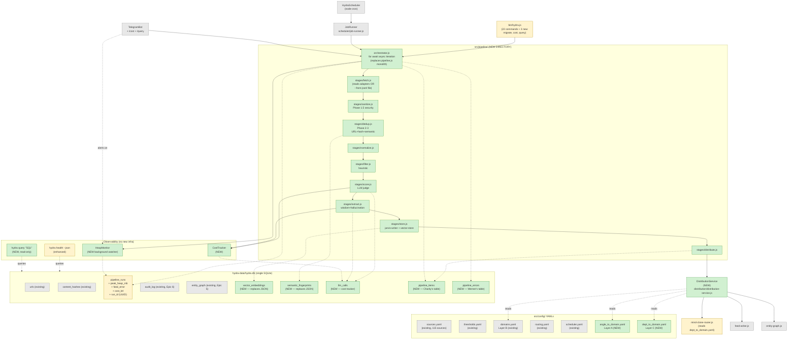

# Architecture §1-§2 — Introduction & High-Level Architecture

**Source:** `../architecture.md` lines 1-176
**Sharded by:** @po, 2026-05-12

---

## 1. Introduction & Scope

### 1.1 Sprint Goal (in Aria's voice)

Restore HYDRA's autonomous 24/7 operation by eliminating the OOM root cause at its source (JSON write-amplification in `vector-store` + `semantic-dedup`), splitting the 963-LOC pipeline monolith into discrete streamable stages, and collapsing the two divergent distribution codepaths (live pipeline vs. `ingest-dossier.mjs`) into a single `DistributionService`. As a side-benefit — and on Charity Majors' insistence — we make the system **queryable**: every item that flows through the pipeline becomes a row in SQLite, addressable via a new `hydra query` CLI, so six months from now we can answer questions we haven't thought to ask yet.

### 1.2 What this document is NOT

- Not a greenfield architecture. We respect existing patterns (ESM + `createRequire` for `better-sqlite3`, JSDoc typedefs, YAML config, pino structured logs, file-based locks).
- Not an opportunity to introduce TypeScript, ORMs, Prometheus, or microservices. The conclave was unanimous: this is a **single-machine CLI tool** and over-engineering would dilute the focus.
- Not implementation. No code is written here. The work is captured in PRD stories 1.1–1.12 and is sharded into developer-actionable units in `../../02-prd/sharded/`.

### 1.3 Scope Boundaries

**IN scope:**
- 2 storage migrations (vector-store + semantic-dedup → SQLite)
- 1 pipeline refactor (monolith → orchestrator + 9 stages, streaming execution)
- 1 distribution consolidation (`DistributionService` + 3-layer YAML config)
- 1 new CLI flag (`--from-jsonl`) + 2 new CLI commands (`hydra cost`, `hydra query`)
- 3 observability table additions (`pipeline_items`, `pipeline_errors`, `llm_calls`)
- 1 column expansion on existing `pipeline_runs` table

**OUT of scope (explicit non-goals):**
- Node 22/24 upgrade (CR6)
- TypeScript migration
- New top-level dependencies (sprint-wide constraint per PRD §3.1)
- HTTP API surface (HYDRA remains CLI-first)
- Replacing Telegram with anything else
- Migrating off Jest

### 1.4 Document Map

| Section | Purpose | Sharded file |
|---------|---------|--------------|
| §2 High-Level Architecture (Target State) | What HYDRA looks like at sprint-end | this file |
| §3 Migration Strategy | Phased plan referencing PRD story numbers | `01-migration-strategy.md` |
| §4 Module Specifications | Each new/changed module: interface, deps, file path, test strategy | `03-modules.md` |
| §5 Data Model Changes | DDL for new tables + columns | `04-data-model.md` |
| §6 Configuration Changes | New YAMLs + env vars | `05-configuration.md` |
| §7 Risk Mitigation Matrix | Maps each PRD §3.5 risk to architectural decision | `06-risk-mitigation.md` |
| §8 Test Strategy | Characterization, benchmark, per-stage failure, observability | `07-test-strategy.md` |
| §9 Rollback Plan | Env flags + JSON restore + git checkpoint | `08-rollback-plan.md` |
| §10 ADR Index | Links to 4 formal ADRs in `adrs/` | `02-adrs.md` |
| §10A Consumption-Side Architecture | Reader side (Story 1.12) | `09-consumption-side.md` |
| §11 Open Questions for Orion | Three resolved questions | `10-open-questions.md` |

---

## 2. High Level Architecture (Target State)

### 2.1 Component Diagram — Post-Sprint

**Legend:** green = new, yellow = changed, gray = preserved unchanged.

### 2.2 Contrast with Current State (`01-analysis` §2.1)

| Concern | Current (DOWN since 16/Abr) | Post-Sprint |
|---------|------------------------------|-------------|
| Entry points | `bin/hydra.js` (22 cmds) + `bin/ingest-dossier.mjs` (divergent) | `bin/hydra.js` (25 cmds, including `--from-jsonl`); `ingest-dossier.mjs` survives as a 1-line wrapper with deprecation warning |
| Pipeline execution | 963-LOC monolith, all items in `allContent[]` array | Orchestrator + 9 stage modules, async iteration, one item at a time |
| `vector-store` persistence | 16.7MB JSON file rewritten per item | SQLite `vector_embeddings` table + in-memory LRU cosine cache (ADR-002) |
| `semantic-dedup` persistence | 20.7MB JSON file rewritten per item | SQLite `semantic_fingerprints` table + LRU cache |
| Distribution routing | 2 codepaths, 2 hardcoded `deptToDomainMap`s in JS | 1 `DistributionService` + 3 YAMLs (angle / domain / dept) |
| Heap peak | OOM at ≥1.7GB (default) and ≥8GB (`--max-old-space-size=8192`) | < 2GB for 5,000-item run (NFR1) |
| Observability | `pino` to disk + Telegram alerts + opaque `pipeline_runs` row | All above + `pipeline_items` row per item + `hydra query` CLI |
| Cost tracking | None | `llm_calls` table + `hydra cost` + Telegram digest in BRL |
| Run failure handling | One bad item kills the whole run (thrown exception bubbles up) | Per-stage `{success, error}` shape; failures land in `pipeline_errors`; run continues |
| MTTR on scheduler crash | ~25 days (actual, per heartbeat) | < 5 min (NFR4) via Telegram alert + documented runbook |

### 2.3 Architectural Style

**Unchanged:** Single-process Node.js CLI tool, SQLite for state, filesystem for artifact output (Jarvis KB markdown, daily digests).

**Refined:** The pipeline transitions from **batch-collecting orchestration** to **stream-processing orchestration**. This is not a new architectural style — it's the obvious style for the problem, and we should have been doing it from day one. Conclave was unanimous: pure async iteration (`for await of`), no Worker threads, no queue-based backpressure, no message bus. Backpressure is `await`.
