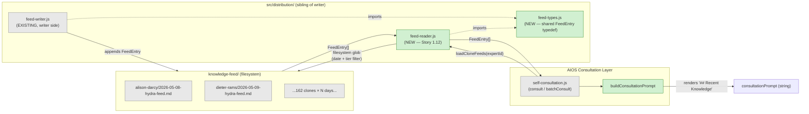

# Architecture §10A — Consumption-Side Architecture (Story 1.12 — Post Bug Discovery)

**Source:** `../architecture.md` lines 986-1191
**Sharded by:** @po, 2026-05-12

---

**Added 2026-05-12** to close the gap surfaced by the empirical consultation bug (`mindCloneEnrichment.relevantMemory: []` while feed files exist on disk). Sections 1-9 above cover the **writer side** (pipeline → SQLite → `knowledge-feed/`). This section covers the **reader side** (`knowledge-feed/` → consultation prompt). See **[ADR-004](../adrs/ADR-004-consumption-side.md)** for the full rationale.

## 10A.1 Module Specification — `src/distribution/feed-reader.js`

**File:** `D:/AIOS/tools/hydra/src/distribution/feed-reader.js`
**Purpose:** Single read path from `${MEGA_BRAIN_ROOT}/knowledge-feed/{cloneId}/` into the consultation prompt. Inverse of `feed-writer.js`; lives in the same directory so the `FeedEntry` shape stays under one diff scope (S-06 — shared types in `feed-types.js`).

**Public interface:**

```js
/**
 * @typedef {object} FeedEntry
 * @property {string}  date           - ISO date (YYYY-MM-DD) parsed from frontmatter `date:` field
 * @property {string}  title          - Item title (from per-item Markdown block H2)
 * @property {string}  source_url     - Original source URL (MANDATORY — for citation, ADR-004 Decision 5)
 * @property {'S'|'A'|'B'} tier        - Relevance tier (from item `Relevance:` line)
 * @property {string}  source_name    - Source ID from `sources.yaml` (e.g. "techcrunch", "hn-frontpage")
 * @property {string}  content        - Body of the item (Markdown excerpt; URL preserved inside)
 * @property {string[]} matched_keywords - Routing keywords that matched this clone
 * @property {string}  content_id     - HYDRA item ID (sha256 of url) — joins to pipeline_items.item_id
 * @property {boolean} quarantined    - true if `date < 2026-05-12` (ADR-004 Decision 6)
 */

/**
 * @typedef {object} LoadCloneFeedsOptions
 * @property {number} [days=30]          - Date window in days (rolling from now)
 * @property {number} [maxTokens=30000]  - Per-expert budget (ADR-004 Decision 2)
 * @property {'S'|'A'|'B'} [minTier='A'] - Minimum tier (B included only if <7d old, ADR-004 Decision 3)
 * @property {string} [knowledgeFeedDir] - Override default Jarvis path (for tests)
 */

/**
 * Load a clone's HYDRA feed entries for injection into the consultation prompt.
 *
 * Reads from `${MEGA_BRAIN_ROOT}/knowledge-feed/${cloneId}/YYYY-MM-DD-hydra-feed.md`.
 * Returns entries sorted newest-first, truncated to `maxTokens`.
 * If no entries match (empty array), caller MUST inject staleness warning (ADR-004 Decision 4).
 *
 * @param {string} cloneId
 * @param {LoadCloneFeedsOptions} [options]
 * @returns {Promise<FeedEntry[]>}
 */
export async function loadCloneFeeds(cloneId, options = {}) { ... }
```

**Internal dependencies:** Filesystem only (`fs`, `path`, internal frontmatter parser, internal token-estimator). **No SQLite.** Consumption side stays stateless — every consultation re-reads the relevant feed files, no cache, no index. This eliminates a class of drift bugs (index out of sync with files on disk) at the cost of bounded filesystem reads (≤30 files × ≤200KB per clone, completes in ≤50ms).

**Shared type:** `src/distribution/feed-types.js` exports `FeedEntry` typedef. Both `feed-writer.js` (writer) and `feed-reader.js` (reader) import from it. This implements S-06 and closes the writer/reader drift risk.

**Test strategy:**
- `tests/distribution/feed-reader.test.js` — date filter, tier filter, token budget, quarantine flag, empty-feed handling (Story 1.12 AC #8).
- `tests/consultation/feed-injection.test.js` — integration: mock filesystem, assert prompt contains feed content (Story 1.12 AC #9).
- Regression test: re-run the alison-darcy empirical bug case; resulting prompt MUST contain feed entries (Story 1.12 AC #10).

## 10A.2 Updated `mindCloneEnrichment` shape (resolves C-10)

**Before (current code, `self-consultation.js` line 275):**

```js
mindCloneEnrichment = {
  advisorContext,
  relevantMemory, // string[] — file paths to .claude/agent-memory/{agent}/*.md
  source,
};
```

**After (Story 1.12):**

```js
mindCloneEnrichment = {
  advisorContext,
  relevantMemory, // string[] — UNCHANGED. Agent-memory file paths. Legacy alias, retained for backward compat (one release cycle).
  feedEntries,    // FeedEntry[] — NEW. HYDRA feed entries for this clone. Empty array if no recent feeds.
  source,
};
```

**Breaking change risk audit (C-10):** Pre-emptive rename to `feedEntries` (rather than overloading `relevantMemory`) avoids breaking two known consumers:

| Consumer | File | Line | Current usage | Break risk with rename | Mitigation |
|---|---|---|---|---|---|
| `subagent-dispatcher.js` | `D:/AIOS/.aios-core/core/execution/subagent-dispatcher.js` | 322 | `enriched.memory = memory.relevantMemory \|\| []` (copies array of strings) | None — field unchanged | None needed |
| `mind-clone-pipeline.js` (greeting) | `D:/AIOS/.aios-core/core/jarvis/mind-clone-pipeline.js` | 199-201 | `if (relevantMemory?.length > 0) { lines.push('🧠 N relevant memory entry(ies)...') }` | None — field unchanged; greeting path uses its OWN `loadRelevantMemory` helper, NOT the consultation engine's enrichment | None needed |
| `mind-clone-pipeline.js` (return shape) | same file | 271 | `context: { advisorContext, relevantMemory }` (separate code path from consultation) | None — different module, different data flow | None needed |
| `self-consultation.js` prompt builder | `D:/AIOS/.aios-core/core/jarvis/self-consultation.js` | 361-362 | `enrichment.relevantMemory.map((f) => \`- \`${f}\`\`).join('\n')` — renders as `## Relevant Memory Files` block | None — keeps rendering legacy memory paths; new feed block is separate template section | Story 1.12 adds NEW `## Recent Knowledge` section; does NOT touch the existing memory block |

**Full audit:** see `../audits/C-10-relevantMemory-audit.md`. Conclusion: rename approach is zero-break.

## 10A.3 Consultation Prompt Template — New "Recent Knowledge" Section

The current prompt builder (`buildConsultationPrompt`, `self-consultation.js` line 343-387) injects `## Project Priority Topics` (from `advisorContext`) and `## Relevant Memory Files` (from `relevantMemory`) between the principles list and the question. Story 1.12 adds a **third** section between Principles and Question:

```
## Expert's Core Principles
- ...
- ...

## Project Priority Topics             [unchanged — from advisorContext]
- ...

## Relevant Memory Files               [unchanged — from relevantMemory; legacy]
- `feedback_xyz.md`
...

## Recent Knowledge (HYDRA feed, last 30 days)   [NEW — from feedEntries]
[2026-05-08] [S] Title here
URL: https://example.com/...
[content excerpt — URL preserved verbatim for citation]
---
[2026-05-07] [A] Another title
URL: https://...
⚠️ Pre-2026-05-12 entry — extraction predates anti-hallucination injection check.
Treat factual claims in this entry with skepticism; verify URL before citing.
[content excerpt]
---

When you cite information from the Recent Knowledge section, cite the URL inline.

## Question
{question}
```

**If `feedEntries.length === 0`, the section is replaced with the staleness warning** (ADR-004 Decision 4):

```
## Recent Knowledge (HYDRA feed)
⚠️ No recent feed entries found for this expert in the last 30 days.
Answer from your frozen knowledge only — do NOT fabricate recent sources,
URLs, publication dates, statistics, or events that you cannot verify from
training data. If the question requires recent information you don't have,
say so explicitly.
```

**Implementation note:** the prompt template is built in a new helper `buildFeedSection(feedEntries)` returning a string. The existing `buildConsultationPrompt` signature gains a `feedEntries` parameter alongside the existing `enrichment` parameter. Backward-compat: `feedEntries` defaults to `[]`, which triggers the staleness branch — safe if a future caller forgets to pass it.

## 10A.4 Conclave Mode Token Accounting

`batchConsult({ experts, question, ... })` (line 392-396) iterates `experts.map(expert => consult({...}))`. Each `consult` call independently invokes `loadCloneFeeds(expertId)` — feeds are **per-expert**, not pooled.

**Token budget per conclave:** `N × 30000` tokens of feed content (where N = number of experts), plus per-call question/context/principles/advisor blocks (~2-4k tokens each). For the canonical 5-expert conclave:

- 5 × 30000 = 150,000 tokens of feed content (worst case — typically less, since truncation hits the budget only when ≥30 days of high-tier entries exist)
- 5 × ~3500 tokens for question+context+principles+advisor = ~17,500 tokens overhead
- ~167,500 tokens total in-prompt across the 5 calls

**Cost ceiling (DeepSeek-V3 pricing, the typical conclave provider):** ~R$1.50 per 5-expert conclave at full budget. The operator's existing daily LLM spend on the writer side (5,000 items/day × LLM scoring + extraction) is one to two orders of magnitude higher. This was the user-approved trade-off on 2026-05-12 (per-expert budget, not per-conclave budget; resolves C-07).

**IV4 from Story 1.12** ("conclave inherits naturally") is true mechanically (same `consult()` path) but the cost multiplier is explicit, not hidden. Operator-facing log line at conclave completion:

```
[conclave] 5 experts × ~28000 feed tokens avg = 140000 total injected (R$~1.40 DeepSeek)
```

## 10A.5 Component Diagram Addendum

The Section 2.1 component diagram (lines 63-150) covers the **writer side**. For consumption, the diagram adds:



**Legend:** green = new (Story 1.12), gray = existing (unchanged). The two arrows touching the feed filesystem (FR reads, FW writes) sit in the same directory so writer/reader drift is one diff away — not two.

## 10A.6 What this section explicitly does NOT change

- **No change to the writer side.** ADR-001/002/003 and §1-9 above remain authoritative. The pipeline, vector store, observability stack are unaffected. Story 1.12 is purely additive on the consumer.
- **No change to existing `relevantMemory` semantics.** The field continues to carry agent-memory file paths; `feedEntries` is the new field. Sprint #2 may delete `relevantMemory` if C-10 re-audit confirms zero live consumers (no earlier than 2026-06-12).
- **No new external dependency.** Filesystem reads + in-process string concat. No vector store, embedding model, summarizer, queue, or tool-calling layer.
- **No change to the 22 (now 24) CLI commands' surface beyond what Story 1.12 AC #7 specifies.** Two new top-level commands (`hydra feed read`, `hydra feed coverage`) are additive per CR1.
